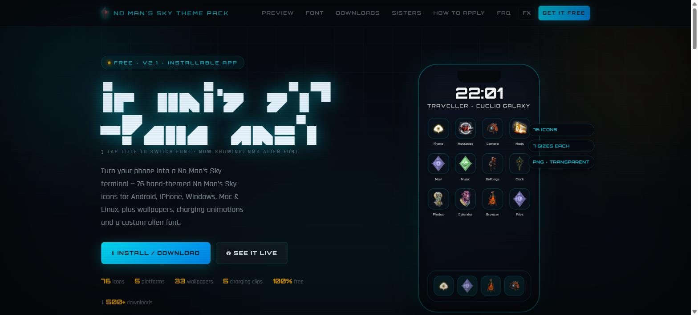
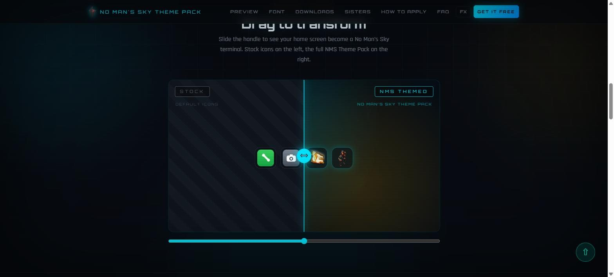
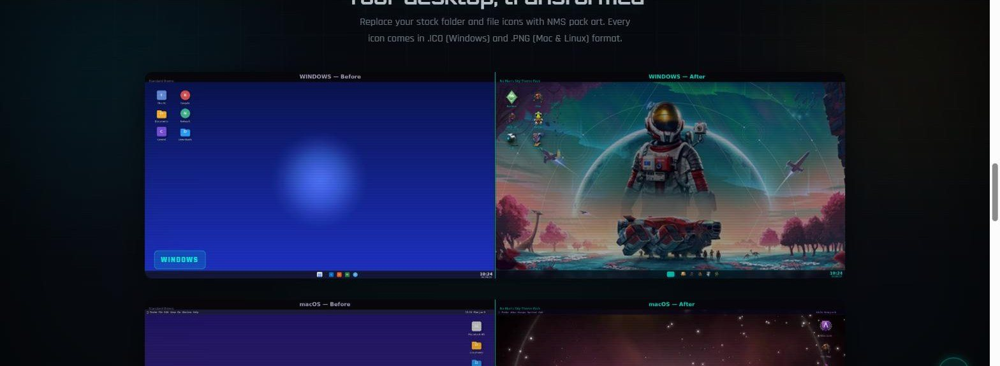

# No Man's Sky Theme Pack

**Live:** [theme.nomansskyhub.app](https://theme.nomansskyhub.app)

Turn your phone or desktop into a *No Man's Sky* terminal. 76 hand-themed icons, 33 wallpapers, 5 charging animations and the alien alphabet as an installable font. Free, no account, for Android, iPhone, Windows, Mac and Linux.

Part of the [No Man's Sky Hub](https://nomansskyhub.app) family of fan tools.

## What's in the pack

- **76 themed icons**, each exported as transparent PNGs in 7 sizes, plus Windows `.ico` versions
- **33 wallpapers** in 6 resolutions each, for phone and desktop
- **5 charging animations** as watermark-free MP4s for Android and iPhone
- **The NMS alien alphabet** as an installable TTF font
- **Widget Kit** for KWGT: two NMS-styled frames, both fonts and a step-by-step clock/date widget guide
- **Setup guides** for Android launchers, iPhone, Windows and Mac

## The site

- An interactive phone mockup and a live grid of every icon
- A live alien-alphabet translator and glyph chart
- A drag-to-compare before/after slider, and before/after desktops for Windows and macOS
- Platform-aware install as an app (Android prompt, iPhone guide)

## How it's built

A plain HTML/CSS/JavaScript site with no build step. Deployed on Netlify straight from this repo: every push to `main` goes live.

| Path | What it is |
|---|---|
| `index.html` | The download site |
| `polish.css`, `polish.js` | HUD-style card treatment and line icons (v2.2 polish) |
| `preview.html` | Full phone preview |
| `HOW_TO_APPLY_ICONS.html` | Setup guide |
| `android_icon_pack_mapping.xml` | Launcher mapping for icon-pack apps |
| `assets/*.zip` | The downloads: icons, wallpapers, charging animations, widget kit |
| `assets/icons/`, `assets/widgets/` | Icon previews and widget kit files |
| `sw.js`, `manifest.json`, `pwa/` | Install and offline support |

## Credits

- NMS Alphabet font by seontonppa (built with FontStruct), used with permission

## Licence

The code is MIT licensed (see `LICENSE`). Game names, icons and imagery belong to Hello Games and are not covered by that licence.

*An unofficial, fan-made project. Not affiliated with, sponsored by, or endorsed by Hello Games.*

Built by elegra1965.
